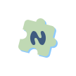

    

    
    
    
     
    
    
    

# NeoDB You

A native Android App for [NeoDB](https://neodb.net/), crafted with Jetpack Compose and Material 3.

> NeoDB is an open-source software and global community platform since 2021.
> It helps users to manage and explore collections, reviews, and ratings for various cultural products,
> including books, movies, music, podcasts, games, and performances.
> Additionally, users can share their collections, publish microblogs, and engage with others in the Fediverse.
> NeoDB integrates the functionalities of platforms like Goodreads, Letterboxd, RateYourMusic, and Podchaser, among others.
> It also supports self-hosting and interconnection through containerized deployment and the ActivityPub protocol.

I develop this App on my free time. Left your Stars if you like it ;)

## Screenshots

## Features

- Login into your favorite [NeoDB servers](https://neodb.net/servers/).
- View trending entries on the server.
- Search for entries using keywords.
- Access detailed information and reviews for any entry.
- Compose and modify your own reviews.
- Visualize your library with heat map.

## Download

- Public release: [GitHub Release](https://github.com/heddxh/NeoDB-You/releases/)
- Nightly: [GitHub Actions](https://github.com/heddxh/NeoDB-You/actions/workflows/nightly.yml). Unzip the artifact and install the apk.

## Localization

Want to help translate the app to your language? Visit our [Weblate page](https://hosted.weblate.org/engage/neodb-you/).

## FAQ

1. `The requested scope is invalid, unknown, or malformed.` when login.

    Type your **NeoDB** server domain instead of your fediverse/mastodon domain. For English user, it is most likely `eggplant.place`.
    For Chinese user, `neodb.social`.

2. Some feature broken on my server.
   
    Currently only test on [neodb.social](https://neodb.social/)
    and [eggplant.place](https://eggplant.place/).
    If you are using other server and meet promblems, open a issue!

## Credits

### Open Source Projects

- [AboutLibraries](https://github.com/mikepenz/AboutLibraries)
- [Compose Shimmer](https://github.com/valentinilk/compose-shimmer)
- [Version Compare](https://github.com/G00fY2/version-compare)
- [Ktorfit](https://github.com/Foso/Ktorfit)
- [Coil](https://github.com/coil-kt/coil)

### Special Thanks

Thanks to [NeoDB](https://neodb.net/) for making the incredible platform for Fediverse.

 

Thanks to [Piecelet](https://github.com/Piecelet/neodb-app) for inspiring me to create this project.
