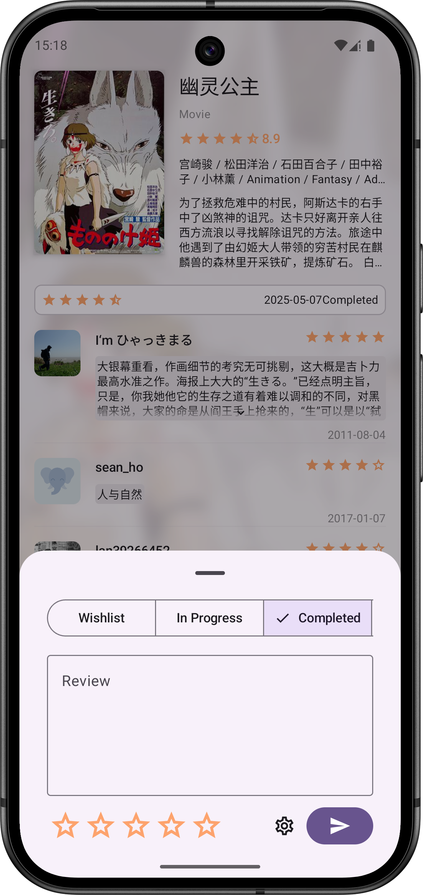

# NeoDB You

A native Android app for [NeoDB](https://neodb.net/), crafted with Jetpack Compose and Material 3.

## Screenshots

## Features

- Login into your favorite [NeoDB servers](https://neodb.net/servers/).
- View trending entries on your server.
- Search for entries using keywords.
- Access detailed information and reviews for any entry.
- Compose and modify your own reviews.
- Visualize your library with an heat map.

## 1.0 Release Goals

- [x] Revoke token when logout.
- [x] Check update.
- [x] Show open source credits.

## Localization

Want to help translate the app to your language? For more details or to get started, visit our [Weblate page](https://hosted.weblate.org/engage/neodb-you/).

## Note

Currently only test on [neodb.social](https://neodb.social/)
and [eggplant.place](https://eggplant.place/).

The APP is still under BETA quality, there are bugs more than Koroks living in Korok Forest(I know),
so feel free to open issues for bugs and missing features.

I develop this APP for fun on my free time. Left your Stars if you like it ;)
