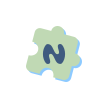
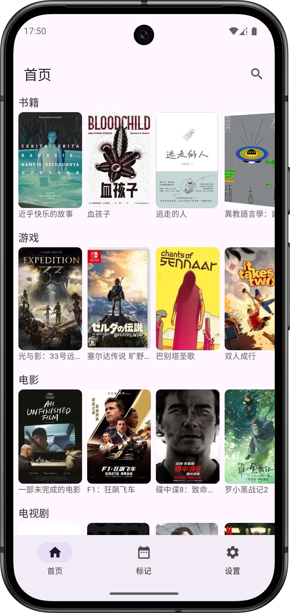
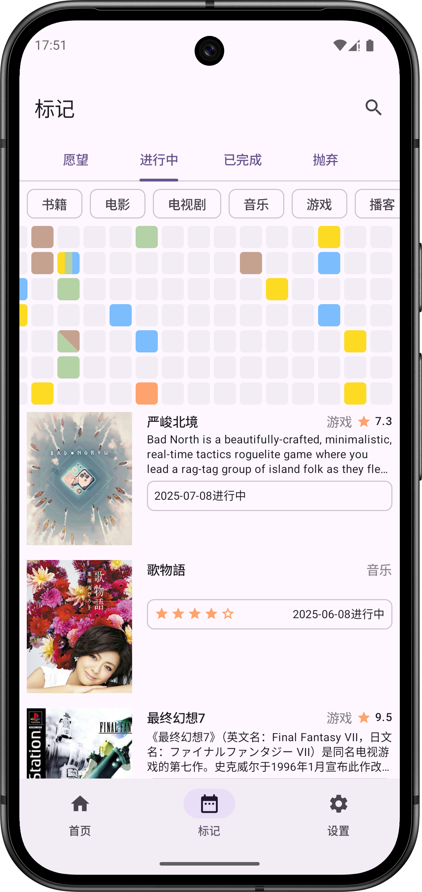
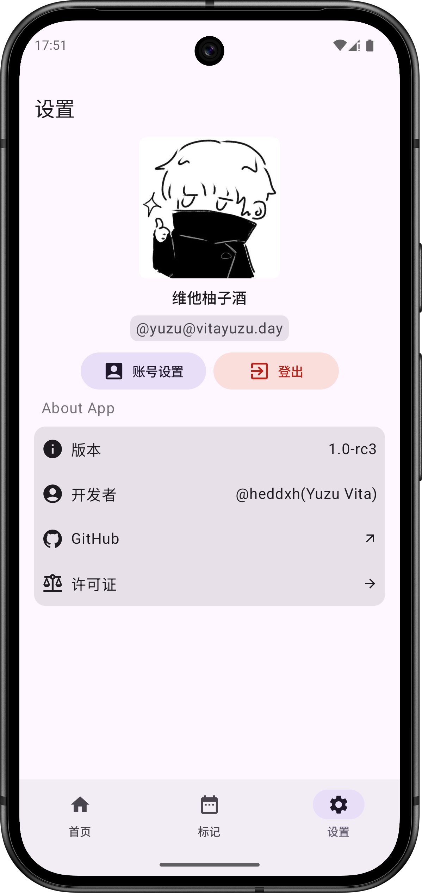

    

    
    
    
     
    
    
    

# NeoDB You

一个使用 Jetpack Compose 和 Material 3 构建的原生 Android 版 [NeoDB](https://neodb.net/) 应用。

> NeoDB 是一个自2021年以来开源的软件和全球社区平台。
> 它帮助用户管理和发现各种文化产品的收藏、评论和评分，
> 包括书籍、电影、音乐、播客、游戏和表演。
> 此外，用户可以分享他们的收藏，发布微博，并与 Fediverse 中的其他人互动。
> NeoDB 整合了 Goodreads、Letterboxd、RateYourMusic 和 Podchaser 等平台的功能。
> 它还通过容器化部署和 ActivityPub 协议支持自托管和互联。

这个应用是我在业余时间开发的。如果你喜欢它，请给我点个 Star ;)

## 截图

## 功能

- 登录你喜欢的 [NeoDB 服务器](https://neodb.net/servers/)。
- 查看服务器上的热门条目。
- 使用关键词搜索条目。
- 访问任何条目的详细信息和评论。
- 撰写和修改你自己的评论。
- 通过热力图可视化你的媒体库。

## 下载

每夜版: [GitHub Actions](https://github.com/heddxh/NeoDB-You/actions/workflows/nightly.yml)（解压产物并安装
APK）。

## 本地化

想帮助将应用翻译成你的语言吗？请访问我们的 [Weblate 页面](https://hosted.weblate.org/engage/neodb-you/)。

## 常见问题

1. **登录时为什么会显示 “The requested scope is invalid, unknown, or malformed.”？**

   请键入你的 **NeoDB** 服务器域名，而不是你的 Fediverse/Mastodon 域名。对于中文用户，很可能是
   `neodb.social`。
   对于英文用户，很可能是 `eggplant.place`。

2. **在我的服务器上某些功能无法正常使用。**

   目前只在 [neodb.social](https://neodb.social/)
   和 [eggplant.place](https://eggplant.place/) 上进行了测试。
   如果你在使用其他服务器时遇到问题，请提交一个 issue！

## 致谢

### 开源项目

- [AboutLibraries](https://github.com/mikepenz/AboutLibraries)
- [Compose Shimmer](https://github.com/valentinilk/compose-shimmer)
- [Version Compare](https://github.com/G00fY2/version-compare)
- [Ktorfit](https://github.com/Foso/Ktorfit)
- [Coil](https://github.com/coil-kt/coil)

### 特别鸣谢

感谢 [NeoDB](https://neodb.net/) 为 Fediverse 打造了这个令人难以置信的平台。

 

感谢 [Piecelet](https://github.com/Piecelet/neodb-app) 激励我创建这个项目。

感谢 [LineageOS](https://lineageos.org/)，没有他们我就没有运行 Android15 的实体机了（Pixel 4 XL）。
